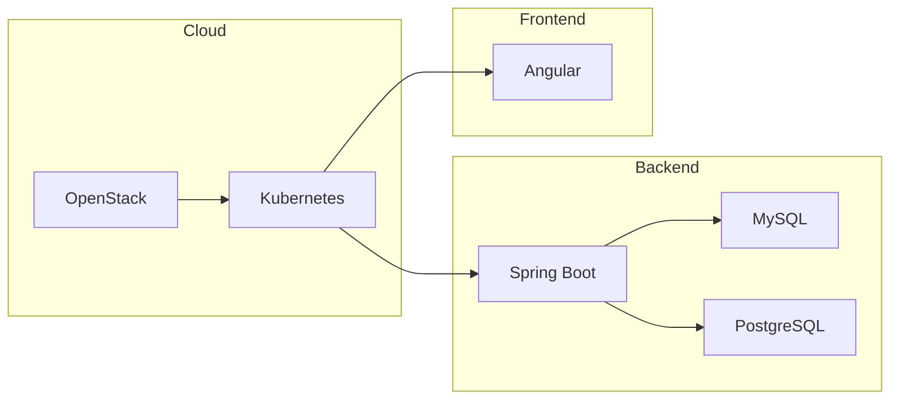

# <span style="color:#1976d2;">StudyBuddy</span>

> <span style="color:#388e3c;"><b>A collaborative, microservices-based platform for students to form study groups, share resources, manage tasks, and communicate in real time.</b></span>

<div align="center">
  <!-- Badges for quick stack overview -->
  
  
  
  
  
  
</div>

<br/>

<!-- Optional: Mermaid diagram for architecture -->
<details>
<summary><b><span style="color:#1976d2;">Click to view architecture diagram</span></b></summary>


</details>

---

## <span style="color:#1976d2;">Table of Contents</span>

- [StudyBuddy](#studybuddy)
  - [Table of Contents](#table-of-contents)
  - [Overview](#overview)
  - [Features](#features)
  - [Architecture](#architecture)
  - [Microservices](#microservices)
  - [Tech Stack](#tech-stack)
  - [Security](#security)
  - [Kubernetes Deployment](#kubernetes-deployment)
  - [Setup Instructions](#setup-instructions)
    - [Prerequisites](#prerequisites)
    - [Quick Start](#quick-start)
  - [Database Setup](#database-setup)
  - [CI/CD](#cicd)
  - [Monitoring and Troubleshooting](#monitoring-and-troubleshooting)
  - [Contributing](#contributing)
  - [License](#license)
  - [Project Status](#project-status)

---

## <span style="color:#1976d2;">Overview</span>

**StudyBuddy** is built with <span style="color:#6DB33F;">Spring Boot</span>, <span style="color:#DD0031;">Angular</span>, <span style="color:#4479A1;">MySQL</span>, <span style="color:#336791;">PostgreSQL</span>, and <span style="color:#00bfae;">WebSockets</span> for scalability, security, and seamless deployment on <span style="color:#326ce5;">Kubernetes</span> over <span style="color:#ED1944;">OpenStack</span>.

**Key Capabilities:**
- <span style="color:#1976d2;">Form and manage study groups with role-based permissions</span>
- <span style="color:#388e3c;">Share and categorize resources securely</span>
- <span style="color:#fbc02d;">Assign and track tasks with deadlines and priorities</span>
- <span style="color:#d32f2f;">Communicate via real-time group and private chat</span>

The modular microservices architecture ensures maintainability and scalability, while <span style="color:#1976d2;">JWT authentication</span> and <span style="color:#1976d2;">Kubernetes Secrets</span> provide robust security.

---

## <span style="color:#1976d2;">Features</span>

- <b style="color:#1976d2;">User Management:</b> Registration, login, profile management, JWT-based authentication
- <b style="color:#388e3c;">Study Groups:</b> Create, join, and manage groups with owner, admin, member, and guest roles
- <b style="color:#fbc02d;">Resource Sharing:</b> Upload, categorize, and version study materials; access restricted to group members
- <b style="color:#d32f2f;">Task Management:</b> Create, assign, and track tasks with deadlines and priorities
- <b style="color:#00bfae;">Real-Time Chat:</b> Group and private messaging via WebSockets with persistent chat history
- <b>Scalable Deployment:</b> Runs on Kubernetes with persistent storage and ingress routing

---

## <span style="color:#1976d2;">Architecture</span>

StudyBuddy uses a <b>microservices</b> approach, with each service responsible for a specific domain. Services communicate via REST or WebSockets and are deployed in a Kubernetes cluster on OpenStack (Dalmatian, Ubuntu 24.04), provisioned using Ansible.

[<b>View Architecture Diagram</b>](https://miro.com/app/board/uXjVI69XbuA=/?share_link_id=764135954399)

---

## <span style="color:#1976d2;">Microservices</span>

| <span style="color:#1976d2;">Service</span> | <span style="color:#1976d2;">Description</span> | <span style="color:#1976d2;">Database</span> | <span style="color:#1976d2;">Key Endpoints</span> | <span style="color:#1976d2;">Config File</span> |
|---------------------|-----------------------------------------------------|-------------|-------------------------------|-------------------------------|
| <b>User Management</b>     | Registration, login, profile, JWT authentication    | MySQL       | `/api/doRegister`, `/api/login`| `user-service-properties`     |
| <b>Study Group</b>         | Group creation, membership, role management         | MySQL       | `/api/groups`                  | `group-service-properties`    |
| <b>Resources</b>           | Upload/download, categorization, versioning         | PostgreSQL  | `/api/ressources`              | `resources-service-properties`|
| <b>Tasks</b>               | CRUD, deadlines, status tracking, group validation  | MySQL       | `/api/tasks`                   | `tasks-service-properties`    |
| <b>Chat</b>                | Real-time messaging, chat history, membership check | MySQL       | `/api/chat`                    | `chat-service-properties`     |

> All configuration files are placed in each service’s `src/main/resources` directory.

---

## <span style="color:#1976d2;">Tech Stack</span>

- **Backend:** <span style="color:#6DB33F;">Spring Boot (Java 21)</span>
- **Frontend:** <span style="color:#DD0031;">Angular</span> (served via Kubernetes Ingress)
- **Databases:** <span style="color:#4479A1;">MySQL</span> (User, Group, Tasks, Chat), <span style="color:#336791;">PostgreSQL</span> (Resources)
- **Authentication:** JWT (HMAC-SHA256, managed via Kubernetes Secrets)
- **Real-Time:** Spring WebSockets
- **Orchestration:** <span style="color:#326ce5;">Kubernetes</span> (Pods, Deployments, Services, Ingress)
- **Storage:** Kubernetes Persistent Volumes (OpenEBS on OpenStack)
- **CI/CD:** GitHub Actions (self-hosted runner)
- **Monitoring:** Prometheus, Grafana

---

## <span style="color:#1976d2;">Security</span>

- **JWT Authentication:** Stateless, short-lived tokens (15–60 min), validated on every request
- **Password Hashing:** BCrypt for secure credential storage
- **Kubernetes Secrets:** Encrypted storage for JWT keys and DB credentials
- **RBAC:** Kubernetes role-based access controls
- **TLS:** NGINX Ingress controller for HTTPS with TLS termination
- **Access Control:** Enforced group membership and role-based permissions

---

## <span style="color:#1976d2;">Kubernetes Deployment</span>

StudyBuddy is deployed on a Kubernetes cluster provisioned on OpenStack (Dalmatian, Ubuntu 24.04) using Ansible.

**Key Components:**
- <span style="color:#1976d2;">Pods/Deployments:</span> Run and manage microservice containers
- <span style="color:#1976d2;">Services:</span> Stable IPs/DNS for inter-service communication
- <span style="color:#1976d2;">Persistent Volumes:</span> OpenEBS-backed storage for databases and files
- <span style="color:#1976d2;">Ingress:</span> NGINX controller routes external traffic
- <span style="color:#1976d2;">Namespaces:</span> Separate `studybuddy-prod` and `studybuddy-dev`
- <span style="color:#1976d2;">ConfigMaps/Secrets:</span> Store configuration and sensitive data
- <span style="color:#1976d2;">GitHub Actions Runner:</span> Self-hosted for CI/CD

**Sample Ingress Configuration:**
```yaml
location ^~ /api/users {
  proxy_pass http://user-service:8083;
  proxy_set_header Host $host;
  proxy_set_header X-Real-IP $remote_addr;
  proxy_set_header X-Forwarded-For $proxy_add_x_forwarded_for;
  proxy_set_header X-Forwarded-Proto $scheme;
}
```

---

## <span style="color:#1976d2;">Setup Instructions</span>

### Prerequisites

- OpenStack (Dalmatian, Ubuntu 24.04) with Nova, Neutron, Cinder, Keystone, Swift, Placement, Glance, Heat, Horizon
- Kubernetes cluster (deployed via Ansible)
- OpenEBS (Jiva storage class)
- Docker, Git
- MySQL and PostgreSQL (deployed via CI/CD)
- NGINX Ingress Controller
- GitHub Actions self-hosted runner
- GitHub Secrets: `KUBE_CONFIG`, `DOCKER_USERNAME`, `DOCKER_PASSWORD`

### Quick Start

1. **Clone the Repository**
   ```sh
   git clone https://github.com/<your-repo>/studybuddy.git
   cd studybuddy
   ```

2. **Configure Service Properties**
   - Create `<service>-properties` files in each backend service’s `src/main/resources` directory.
   - Example for user service:
     ```properties
     spring.datasource.url=jdbc:mysql://mysql:3306/studybuddy_user
     spring.datasource.username=root
     spring.datasource.password=<your-mysql-password>
     jwt.secret=<your-jwt-secret>
     ```

3. **Set Up Kubernetes Secrets**
   ```sh
   kubectl create secret generic studybuddy-secrets \
     --from-literal=jwt-secret=<your-jwt-secret> \
     --from-literal=mysql-password=<your-mysql-password> \
     --from-literal=postgres-password=<your-postgres-password>
   ```

4. **Deploy with CI/CD**
   - Push to the `production` branch to trigger deployment:
     ```sh
     git push origin production
     ```
   - Monitor deployment in GitHub Actions.

5. **Verify Deployment**
   ```sh
   kubectl get pods -n studybuddy-prod
   kubectl get ingress -n studybuddy-prod
   ```

6. **Access the Application**
   - Open `https://studybuddy.example.com` in your browser.

---

## <span style="color:#1976d2;">Database Setup</span>

MySQL and PostgreSQL instances are automatically deployed by the CI/CD pipeline for each service. Ensure credentials in `<service>-properties` match those in Kubernetes Secrets.

---

## <span style="color:#1976d2;">CI/CD</span>

- **Pipeline:** Defined in `.github/workflows/production.yml`
- **Triggers:** Pushes to `production` branch
- **Steps:** Deploys databases, builds/pushes Docker images, applies Kubernetes manifests, ensures rollout

Monitor pipeline status in the GitHub Actions tab.

---

## <span style="color:#1976d2;">Monitoring and Troubleshooting</span>

- **Monitoring:** Prometheus and Grafana dashboards
- **Troubleshooting:**
  - PVC Not Bound: Check OpenEBS and storage class
  - Runner Offline: Verify runner pod and GitHub registration
  - Deployment Fails: Inspect pod logs and configuration files
  - Database Errors: Check service credentials and DB status
  - OpenStack Issues: Use Horizon and CLI tools for diagnostics

---

## <span style="color:#1976d2;">Contributing</span>

We welcome contributions! Please:

1. Fork the repository
2. Create a feature branch (`git checkout -b feature/your-feature`)
3. Commit changes with descriptive messages
4. Push to your branch and open a Pull Request

See our [Code of Conduct](./CODE_OF_CONDUCT.md) and [Contributing Guidelines](./CONTRIBUTING.md).

---

## <span style="color:#1976d2;">License</span>

This project is licensed under the **MIT License**. See [LICENSE.md](./LICENSE.md) for details.

---

## <span style="color:#1976d2;">Project Status</span>

**Production-ready** as of May 2025, running on OpenStack Dalmatian and Kubernetes.  
For issues or feature requests, use [GitHub Issues](https://github.com/<your-repo>/studybuddy/issues).

**Planned enhancements:** Resource versioning  and ELK Stack logging.
